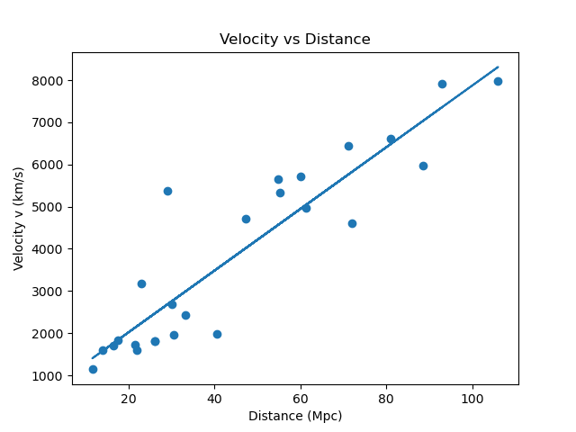

# Calculating the Hubble Constant
This Python project calculates the Hubble Constant ($H_0$) using spectroscopic data and galaxy distances, based on the methodology described in this [Rediscovering the Expansion of the Universe With Python](https://www.instructables.com/Rediscover-the-Expansion-of-the-Universe-With-Pyth/) guide by Ryan3D. The original .csv file was obtained from this link, which already included distances and names.

# Overview
The Hubble Consant describes the rate at which the universe is expanding. By analyzing the redshift of galaxy spectra and their known distances, this code applies Hubble's Law to compute $H_0$.

The script performs three main tasks. Loads the galaxy data, including spectral lines and distances from Cephid variables or redshift-independent methods, calculates the redshift by comparing the observed alpha hydrogen wavelengths to theory, then fits a linear regression to the redshift-distance relationship, deriving $H_0$.

# Theory

## What is the Hubble Constant?
The Hubble Constant links a galaxy's recessional velocity to its distance through Hubble's Law: $$v = H_0 \times d$$ where $H_0$ is expressed in kilometers per second per megaparsec. The accepted value is about 70 km/s/Mpc.

## The Universe is Expanding?
Yes I suppose it is. In 1929, Edwin Hubble's observations revealed that distant galaxies recede faster than nearby ones, implying an expanding universe. This was originally predicted by Albert Einstein in his theory of general relativity, but Einstein believed the universe was static until Hubble's work. 

## Galaxy Spectrum and What They Tell Us
Galaxies emit light at characteristic wavelengths (ex. Hydrogen-alpha at 656.28 nm). When a galaxy moves away from Earth, its light shifts towards longer (redder) wavelengths due to the Doppler effect. The redshift (z) is calculated as:
$$\frac{\lambda_{\text{observed}} - \lambda_{\text{rest}}}{\lambda_{\text{rest}}}$$

For non-relativistic speeds, recessional velocity simplifies to: $v \approx c \times z$ where c is the speed of light.

## The Age of the Universe?
The Hubble Constant not only measures the current expansion rate of the universe, but also provides an estimate for the age of the universe. Assuming expansion has been constant over time, the age can be approximated as the inverse of $H_0$. This is called the Hubble time. 

**However, the actual age differs due to changes in the rate of expansion.**

# Results
The Hubble Constant was calculated to be approximately 73.190390 km/s/Mpc. 

The age of the universe was found to be 13.37 billion years.
